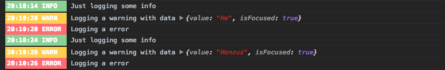

<h1 align="center">
  
</h1>
<h1 align="center">react-native-log-level</h1>
<div align="center">
  <strong>Multi level logger for React Native</strong>
</div>
<br>
<div align="center">
  <a href="https://npmjs.org/package/react-native-log-level">
    
  </a>
  <a href="https://npmjs.org/package/react-native-log-level">
  
  </a>
  <a href="https://github.com/feross/standard">
    
  </a>
  <a href="https://github.com/prettier/prettier">
    
  </a>
  <a href="https://travis-ci.org/tiaanduplessis/react-native-log-level">
    
  </a>
    <a href="https://codecov.io/gh/tiaanduplessis/react-native-log-level">
  
</a>
    <a href="https://greenkeeper.io/">
    
  </a>
  <a href="https://github.com/tiaanduplessis/react-native-log-level/blob/master/LICENSE">
    
  </a>
  <a href="http://makeapullrequest.com">
    
  </a>
</div>
<br>
<div align="center">
  <a href="https://github.com/tiaanduplessis/react-native-log-level/watchers">
    
  </a>
  <a href="https://github.com/tiaanduplessis/react-native-log-level/stargazers">
    
  </a>
  <a href="https://twitter.com/intent/tweet?text=Check%20out%20react-native-log-level!%20https://github.com/tiaanduplessis/react-native-log-level%20%F0%9F%91%8D">
    
  </a>
</div>
<br>
<div align="center">
  Built with ❤︎ by <a href="https://github.com/tiaanduplessis">tiaanduplessis</a> and <a href="https://github.com/tiaanduplessis/react-native-log-level/contributors">contributors</a>
</div>

<h2>Table of Contents</h2>
<details>
  <summary>Table of Contents</summary>
  <li><a href="#features">Features</a></li>
  <li><a href="#install">Install</a></li>
  <li><a href="#usage">Usage</a></li>
  <li><a href="#contribute">Contribute</a></li>
  <li><a href="#license">License</a></li>
</details>

## Features

- Includes 5 different log levels (`trace`, `debug`, `info`, `warn` & `error`)
- Colorized output
- No external dependencies
- Returns the value provided for cleaner logging
- Only logs during development

## Install

```sh
$ npm install react-native-log-level
# OR
$ yarn add react-native-log-level
```

## Usage

```js
import createLogger from 'react-native-log-level'

// Create a instance
const log = createLogger({
    level: 'info' // Optionally set the log level. Defaults to 'info'
})

const obj = {
  foo: 1,
  bar: 2
}

log.trace('hi')
log.debug('hi')
log.info('hi', obj)
log.warn('hi', obj)
log.error('hi')
```

Since the value logged is returned, cleaner logging is possible

```js

if (log.info(it === anotherThing)) {
  // Do Stuff
}

```

## Contributing

Contributions are welcome!

1. Fork it.
2. Create your feature branch: `git checkout -b my-new-feature`
3. Commit your changes: `git commit -am 'Add some feature'`
4. Push to the branch: `git push origin my-new-feature`
5. Submit a pull request :D

Or open up [a issue](https://github.com/tiaanduplessis/react-native-log-level/issues).

## License

Licensed under the MIT License.
